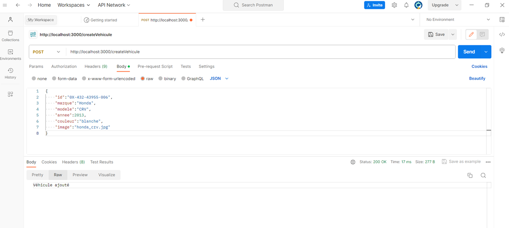
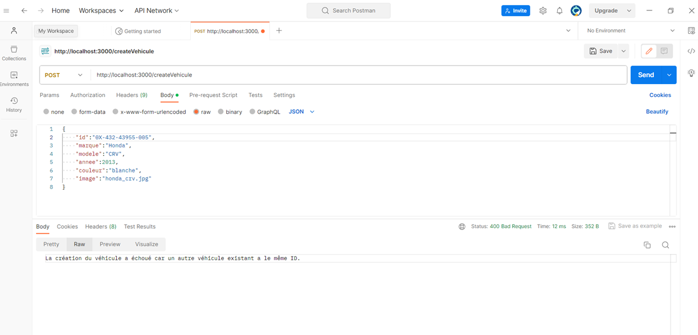
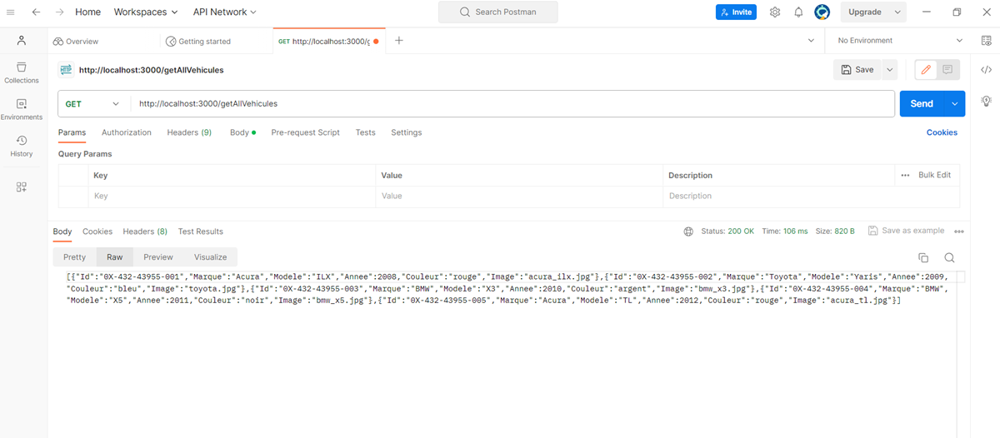
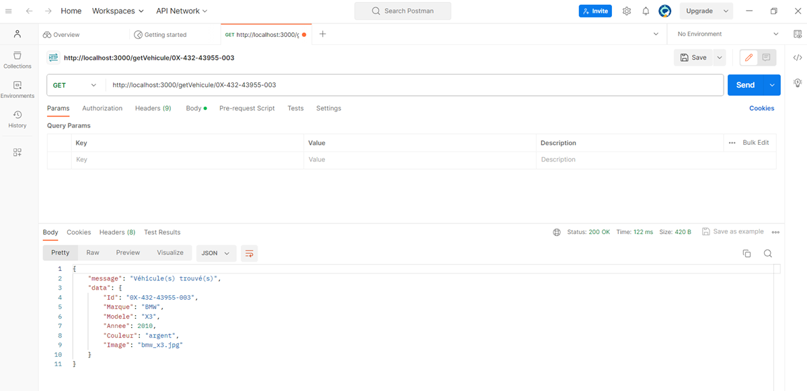

# CarsManagment_NodeJs_RestFull_Services

This is a web application for vehicle management using RestFull web services with Node.JS technology. 
Other tools used: MySql Database, HTML, Javascript, CSS and Service testing with Postman.

## CarsManagment Description

This is a web application for vehicle management using RestFull web services with Node.JS technology.

### Server side 

RestFull web services used in the server side

#### List all vehicles: 

A Web service (GET) which allows you to retrieve all vehicles in JSON format.

#### Search for a vehicle with its id: 

A Web service (GET/id) which allows you to retrieve a vehicle in JSON format whose id is provided as the URL of the request.

#### Add a new vehicle: 

A web service (POST) that allows you to add a new vehicle using the method POST. The vehicle to add is provided in the request body in JSON format. The web service returns a message confirming the addition of vehicle.

#### Modify Vehicle: 

A web service that allows you to modify an existing vehicle using the PUT method. The vehicle to modify is provided in the body of the request in JSON format. The web service should return a message confirming the vehicle modification.

#### Delete a vehicle: 

A web service that allows you to delete a vehicle whose ID is provided in the URL of the request using the DELETE method. The web service should return a vehicle deletion confirmation message.

### Client side 

#### Using Postman to test RestFull services.

#### Use HTML, Javascript and CSS to develop a web application that calls all previous RestFull services.

## Prerequisites
Before starting this project, make sure you have installed the following software: • Node.JS for server side application • MySql SGBD.

## Install

1. Clone this repository on your local machine:

   git clone https://github.com/boumhamdifatima/CarsManagment_NodeJs_RestFull_Services.git

2. Create a MySql database by running the sql script: Database.sql

3. Configure your database by modifying host, user, password ans database connection information in ServeurGestionVehicule/app.js file.

4. Import ServeurGestionVehicule into your IDE.

5. Run the server side application with "npm start" command.

6. Open ClientGestionVehicule/index.html file in your browser.

## Features

### List all vehicles.

### Search for a vehicle with its id.

### Add a new vehicle.

### Modify Vehicle.

### Delete Vehicle.

## Demonstration

### Examples of tests with Postman

#### Add a new vehicle

#### Add a new vehicle(failed)

#### List all vehicles

#### Search for a vehicle with its id

### Client side demonstration

## Contribute

If you would like to contribute to this project, please follow these steps:

   Fork the project
   
   Create a new branch (git checkout -b feature/new-feature)
   
   Make changes and add features
   
   Commit changes (git commit -am 'Add new feature')
   
   Push changes to the branch (git push origin feature/new-feature)
   
   Create a new Pull Request 

## Author 

Fatima Boumhamdi - @FatimaBoumhamdi 

## License 

This project is licensed under the MIT License - see the LICENSE file for details.

